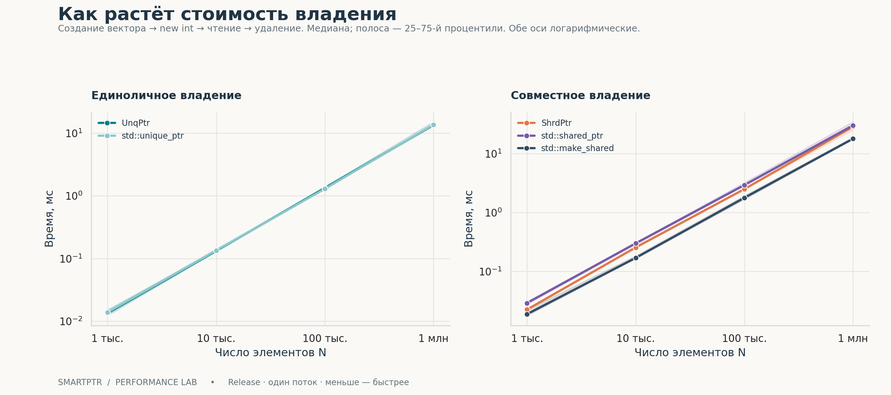
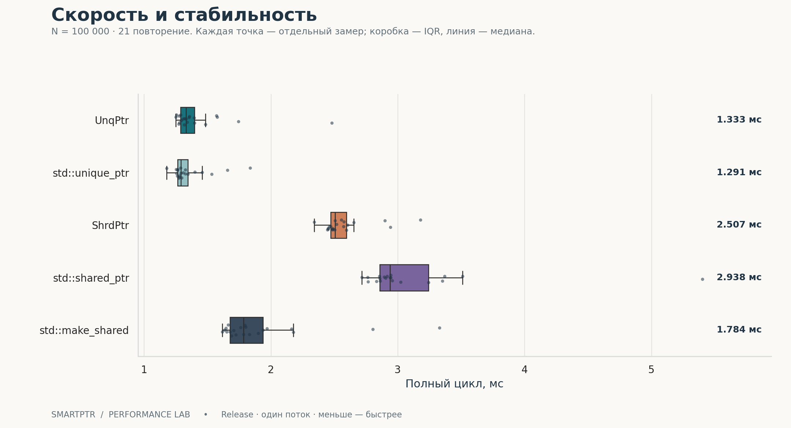
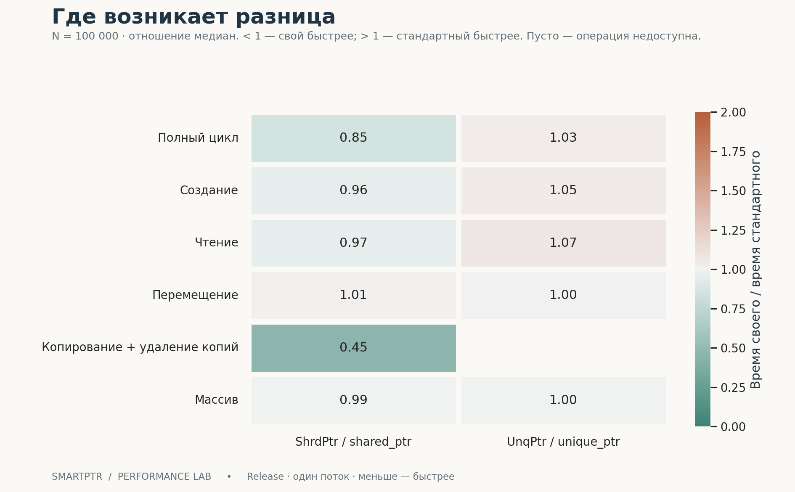
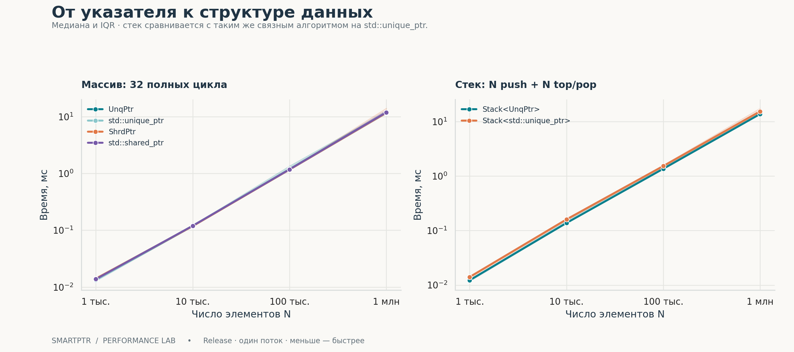

# SmartPtr: сравнение производительности

Реальные локальные измерения UnqPtr, ShrdPtr и стандартных указателей C++.
Оформленный HTML-отчёт: [report.html](report.html). Дата UTC: 2026-10-01T15:25:29+00:00.

## Основные результаты

- При N = 100 000 полный цикл UnqPtr занимает 1.333 мс, std::unique_ptr — 1.291 мс. Отношение времён — 1.03×.

- ShrdPtr: 2.507 мс; std::shared_ptr(new int): 2.938 мс. Отношение — 0.85×. Сравнение относится к одному потоку; ShrdPtr не синхронизирует счётчик ссылок.

- std::make_shared: 1.784 мс; отношение к std::shared_ptr(new int) — 0.61×. Это отдельный способ выделения памяти, показанный как дополнительный ориентир.

- Эти замеры показывают поведение конкретной машины и сборки. Небольшие различия при пересекающемся IQR не доказывают устойчивое преимущество; статистическая значимость здесь не проверяется.

| Реализация | Медиана, мс | IQR, мс | нс / элемент | Замеров |
| --- | --- | --- | --- | --- |
| UnqPtr | 1.333 | 1.287–1.397 | 13.326 | 21 |
| std::unique_ptr | 1.291 | 1.264–1.347 | 12.909 | 21 |
| ShrdPtr | 2.507 | 2.470–2.597 | 25.066 | 21 |
| std::shared_ptr | 2.938 | 2.859–3.244 | 29.385 | 21 |
| std::make_shared | 1.784 | 1.677–1.938 | 17.843 | 21 |

## Масштабирование



## Разброс замеров



## Отдельные операции



## Массивы и стек



## Все операции при N = 100 000

| Сценарий | Реализация | Медиана, мс | нс / единицу работы |
| --- | --- | --- | --- |
| Создание | UnqPtr | 0.567 | 5.668 |
| Создание | std::unique_ptr | 0.542 | 5.418 |
| Создание | ShrdPtr | 1.080 | 10.802 |
| Создание | std::shared_ptr | 1.128 | 11.278 |
| Создание | std::make_shared | 0.591 | 5.914 |
| Чтение | UnqPtr | 0.775 | 0.242 |
| Чтение | std::unique_ptr | 0.721 | 0.225 |
| Чтение | ShrdPtr | 0.934 | 0.292 |
| Чтение | std::shared_ptr | 0.967 | 0.302 |
| Чтение | std::make_shared | 1.329 | 0.415 |
| Перемещение | UnqPtr | 1.880 | 0.587 |
| Перемещение | std::unique_ptr | 1.872 | 0.585 |
| Перемещение | ShrdPtr | 2.855 | 0.892 |
| Перемещение | std::shared_ptr | 2.827 | 0.884 |
| Перемещение | std::make_shared | 2.816 | 0.880 |
| Копирование + удаление копий | ShrdPtr | 2.123 | 1.327 |
| Копирование + удаление копий | std::shared_ptr | 4.684 | 2.928 |
| Копирование + удаление копий | std::make_shared | 4.605 | 2.878 |
| Массив | UnqPtr | 1.185 | 0.370 |
| Массив | std::unique_ptr | 1.186 | 0.371 |
| Массив | ShrdPtr | 1.172 | 0.366 |
| Массив | std::shared_ptr | 1.179 | 0.368 |
| Стек | Stack<UnqPtr> | 1.363 | 13.627 |
| Стек | Stack<std::unique_ptr> | 1.530 | 15.300 |

## Методика

- Release, C++20, без санитайзеров и LTO. Тесты корректности выполняются отдельно с AddressSanitizer и UndefinedBehaviorSanitizer; проверки assert включены.

- Четыре размера N: 1 000, 10 000, 100 000, 1 000 000. Для каждого сочетания — 3 прогрева и 21 учитываемое повторение. Всего 2,436 измерений. Порядок случаев перемешивается на каждом проходе, seed = 20261001.

- steady_clock измеряет стеновое время. Используются медиана и межквартильный интервал (25–75%); IQR описывает разброс замеров и не является доверительным интервалом.

- Полный цикл включает создание вектора, N отдельных объектов int, чтение и уничтожение. Создание отдельно: вектор подготовлен заранее, чтение и удаление за границей таймера.

- Чтение: 32 прохода по заранее созданным объектам. Перемещение: 16 проходов туда и обратно между двумя подготовленными векторами, 32N move-присваиваний; получатель пустой.

- Копирование: 16 созданий вектора копий и его уничтожений. Включены выделение буфера вектора, увеличение и уменьшение счётчиков; нс / единицу — одна пара копирование + уничтожение, а не одна инструкция.

- Массив: 32 цикла new int[N], заполнение, чтение, delete[]. Нормирование — на 32N обработанных элементов. Для полного цикла, создания и стека единица работы — один элемент; для чтения — одно разыменование; для перемещения — одно move-присваивание.

- Стек: N push и N top/pop. Стандартный контроль реализован тем же связным алгоритмом с итеративным удалением, на std::unique_ptr; это не std::stack с иным контейнером.

- Непрозрачная функция в отдельной единице трансляции делает буферы наблюдаемыми для оптимизатора. Все случаи проверяют сумму i % 97 + 1; перемещение дополнительно проверяет пустые источники, копирование — use_count() == 1 после удаления копий.

## Ограничения

- ShrdPtr использует обычный счётчик ссылок. Стандартный shared_ptr поддерживает безопасное изменение владения разными экземплярами в разных потоках; общий набор гарантий у реализаций различается.

- Использован системный аллокатор. Создание отдельных int и служебных блоков может доминировать над стоимостью оболочки указателя. Кэш и аллокатор находятся в прогретом состоянии; холодный старт не измерен.

- В этой серии не контролируются частота CPU, фоновые процессы и привязка к ядру. Отдельные процессы и повторения на других машинах не выполнялись.

- Память, многопоточность, weak_ptr, пользовательские deleter и большие объекты не измерялись. Отчёт не утверждает функциональную эквивалентность своих указателей стандартным.

## Окружение

| Параметр | Значение |
| --- | --- |
| Дата (UTC) | 2026-10-01T15:25:29+00:00 |
| CPU | arm |
| Система | macOS-26.6.2-arm64-arm-64bit-Mach-O |
| Архитектура | arm64 |
| Компилятор | Apple clang version 21.0.0 (clang-2100.3.34.2) |
| Флаги |  -O3 -DNDEBUG |
| Python | 3.13.5 |
| Seaborn | 0.13.2 |
| Потоков | 1 |
| Проверка | CTest: 1/1, ASan + UBSan |

## Воспроизведение

```sh
python3 -m venv .venv
.venv/bin/python -m pip install -r benchmarks/requirements.txt
.venv/bin/python benchmarks/run.py

# Перестроить оформление из сохранённых данных:
.venv/bin/python benchmarks/report.py
```

[Исходные CSV](raw.csv) · [Сводные CSV](summary.csv) · [Окружение JSON](environment.json).
